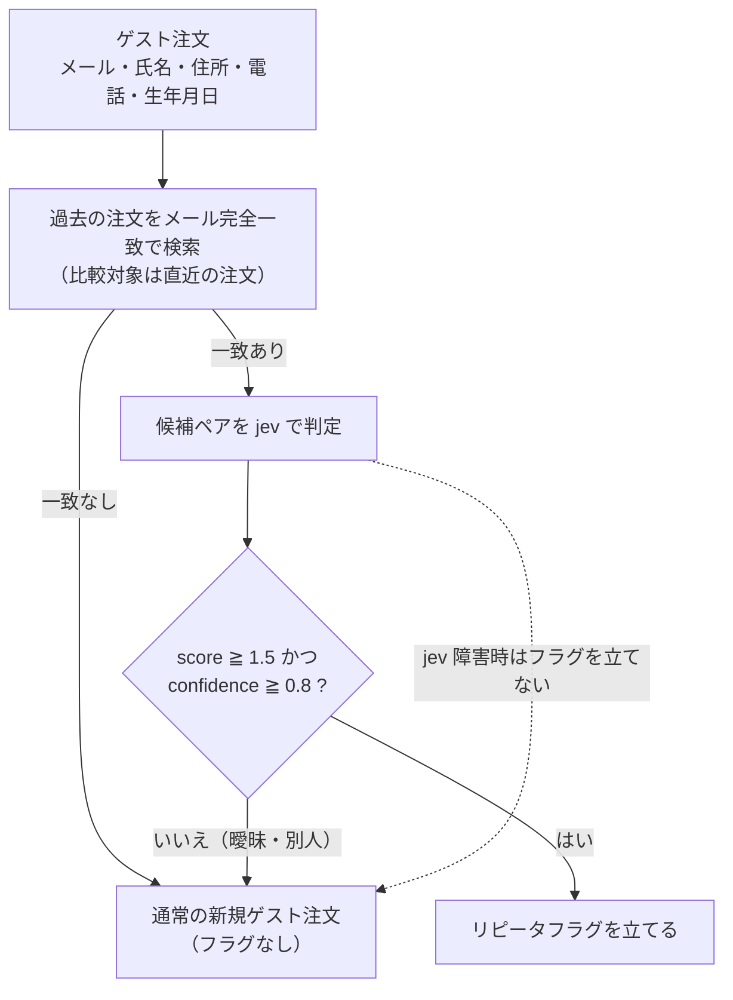
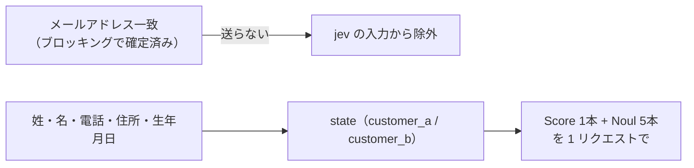
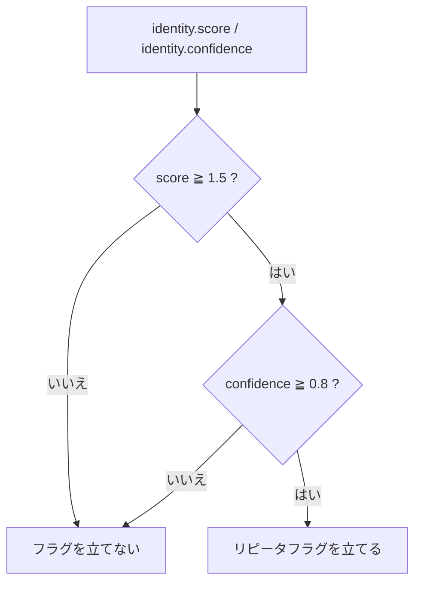

# ゲスト注文のリピータ判定（EC サイト / jev）

EC サイトのゲスト注文で入力されたメールアドレスが過去の注文と一致したとき、
**同一人物かどうかを jev（TypeSafe）で判定**し、注文データに**リピータフラグを立てるかどうかだけ**を決める設計です。

- 作成日: 2026-09-23（同日に設計変更を反映）
- 使用モデル: `jev-latest`（実測時の実体は `jev-1.13.0`）
- 評価: 日本語 30 パターン（`npm run eval:name-matching`）
- 前提知識: [入力モデレーション（moderation.md）](./moderation.md) と同じ jev の使い方。名寄せ一般の整理は [§6 応用](./moderation.md#6-応用-顧客データの名寄せ判定entity-alignment) を参照

---

## 1. ユースケースと要件

### 1.1 前提

| 項目 | 内容 |
|------|------|
| 目的 | **不正注文チェックの補助**（新規客の不正が多いため、リピータと確認できた注文を安全側のシグナルとして扱う） |
| データモデル | **顧客マスタは持たない。注文データのみ**（ゲスト注文） |
| 処理 | 新規注文に**リピータフラグを立てるかどうかだけ**を決める。マージもアカウント付与もしない |
| 一次絞り込み | 過去の注文から**メールアドレスの完全一致**で抽出（プログラム）。比較対象は**直近の注文** |
| 二次判断 | 抽出した候補ペアを **jev が判定**（姓・名・電話・住所・生年月日） |
| メールの扱い | **メールが一致している事実は jev に伝えない**（§2.2） |
| 入力項目 | 物販 EC のため**住所は必須**、酒類を扱うため**生年月日も必須**（＝判定材料は常に揃う前提） |
| バックフィル | しない（今後の新規注文のみを判定する） |

### 1.2 2 つの結末

| 分岐 | 条件 | 処理 |
|------|------|------|
| リピータと確認できた | score が高く確信度も高い | **リピータフラグを立てる** |
| それ以外 | 判断が曖昧・別人・jev 障害 | **フラグを立てず、通常の新規ゲスト注文として処理** |

**エラー表示も認証画面も出しません。** 「判定できないときは何もしない」が最も安全で、UX も壊しません。

### 1.3 誤りの向き（この設計で最も重要な点）

用途が不正チェックなので、**2 種類の誤りの重さが非対称**です。

| 誤り | 何が起きるか | 重さ |
|------|--------------|------|
| **誤フラグ (FP)**：別人なのにリピータと判定 | 不正注文が「リピータ」として信頼側に倒れ、審査をすり抜けうる | **重い**（セキュリティ） |
| **取りこぼし (FN)**：リピータなのにフラグが立たない | 正規のリピータが新規扱いになり、余計な審査が入る | 軽い（安全側・運用コストのみ） |

したがって **「確実な同一人物だけにフラグを立てる」＝適合率重視**が正しい設計です。
閾値を緩めると再現率は上がりますが、それは**不正を見逃す方向**に効きます。

> 不正者が他人のメールアドレスを入手して注文する場合、配送を受け取るために**自分の属性**を入力します。
> つまり「属性が一致しないこと」自体が不正のシグナルであり、この設計はそれを「フラグなし」として扱います。

### 1.4 全体の流れ



---

## 2. jev への問い合わせ設計

### 2.1 何を送り、何を送らないか



**メールを送らない理由**

1. **判断を引きずらせないため。** メール一致は今回の判定で「疑わしい対象」そのものです。これを state に入れると、モデルが「メールが一致しているのだから同一人物だろう」とアンカリングする可能性があります。
2. **PII を減らせる。** メールアドレスは識別性が高く、送らなくて済むなら送らない方が良い項目です。

結果として jev は「**個人属性だけを見て同一人物かどうかを判断**」します。実測でも、同姓同名の別人（D01）や全項目が異なるケース（D05）は score 0.06 / 0.00 で ② に落ちています。

### 2.2 state の形

```json
{
  "customer_a": {
    "surname": "佐藤",
    "given_name": "太郎",
    "phone": "090-1234-5678",
    "address": "東京都新宿区西新宿2-8-1",
    "birth_date": "1985-04-12"
  },
  "customer_b": {
    "surname": "佐藤",
    "given_name": "太郎",
    "phone": "09012345678",
    "address": "東京都新宿区西新宿二丁目8番1号",
    "birth_date": "1985年4月12日"
  }
}
```

- **値は正規化しないでそのまま渡します。** 表記ゆれの吸収は jev の役割であり、事前に正規化するとその能力を使えません（例：`2-8-1` と `二丁目8番1号`）。
- 姓と名は**分けて**渡します（「姓だけ一致」と「フルネーム一致」を区別させるため）。

### 2.3 質問（1 リクエストにまとめる）

| ID | 型 | 問い |
|----|----|------|
| `identity` | Score 3 レベル | 2 つのレコードは同一人物か |
| `same_surname` | Noul | 姓は同じか（カナ/漢字・旧姓を許容） |
| `same_given_name` | Noul | 名は同じか（カナ/漢字・表記ゆれを許容） |
| `same_phone` | Noul | 電話番号は同じか（ハイフン・全角を許容） |
| `same_address` | Noul | 住所は同じか（数字表記・都道府県省略を許容） |
| `same_birth_date` | Noul | 生年月日は同じか（日付形式を許容） |

`identity` の 3 レベル（**レベル 0・1 が「フラグなし」、レベル 2 が「フラグあり」に対応**）：

| レベル | 記述 | 扱い |
|--------|------|------|
| 0 | They are different people: the identifying details disagree in ways that a variant spelling, a move, or a name change cannot explain. | フラグを立てない |
| 1 | It is not clear whether they are the same person: some details agree and others disagree, a detail is missing, or the difference could come from a life change such as marriage or moving house. These records alone are not enough to decide. | フラグを立てない |
| 2 | They are the same person: the details agree once kana/kanji variants, address formatting, date formats, and name changes are taken into account. | フラグを立てる（§2.4 の条件を満たすとき） |

- **レベル 1 の文言が重要**です。「改姓・転居・情報欠落」を明記することで、
  正当な同一人物を「別人」と断定せず、**確信度の低い回答**として返させます（結果的にフラグは立ちません）。
- 5 本の Noul は判定には使いませんが、**どの項目が食い違っているかの記録**と、
  誤フラグが起きたときの事後検証の材料になります。
- 電話・生年月日は本来「数値の比較」なのでコードでも判定できますが、
  **表記ゆれ（全角/半角・ハイフン・日付形式）の吸収を jev に任せる**ために state に含めて質問しています。

### 2.4 判定ルール（フラグを立てる条件）

判定は **1 つの条件だけ**で済みます。

| 条件 | 処理 |
|------|------|
| `identity.score >= 1.5` **かつ** `identity.confidence >= 0.8` | リピータフラグを立てる |
| それ以外（スコアが低い・確信度が低い） | フラグを立てない（新規ゲスト注文として処理） |



**確信度の下限が必要な理由**は §3.3 に実測を示します（項目が欠落したペアで score だけが高くなるケースがあるため）。
用途が不正チェックなので、この下限は**上げる方向に倒す余地**があります（例 `confidence >= 0.9`）。
実測では同一人物 11 件がすべて 0.95 以上なので、0.9 に上げても取りこぼしは増えません。

### 2.5 実装のポイント

- **判定は 1 箇所に置く。** 注文の登録経路が複数（Web / 管理画面 / バッチ）ある場合、経路ごとに実装すると抜け道ができます。
- **失敗時はフラグを立てない（fail-safe）。** TypeSafe が応答しない場合は判定をスキップし、通常の新規ゲスト注文として処理します。ユーザーには何も起きず、影響は「リピータを取りこぼす」方向にだけ出ます。
  - ただし**フラグ率が急落しても気づけない**ため、エラーログの監視は必須です（§4.8）。
- 応答の `model`（例 `jev-1.13.0`）、`score`、`confidence`、項目別 Noul をログに残してください。閾値の見直しと、誤フラグ発生時の事後検証に必要です。

### 2.6 コストとレイテンシ

| 項目 | 実測値 |
|------|--------|
| 入力トークン | **777 / ペア**（顧客 2 件 + Score 1 + Noul 5） |
| 1 ペア | **約 $0.000033（≒ ¥0.005）** |
| 1 万ペア | 約 $0.33（¥50） |
| 100 万ペア | 約 $33（¥5,000） |
| jev の API 往復 | 約 0.2〜0.25 秒（ウォーム時）。詳細は [moderation.md §3.5](./moderation.md#35-レイテンシ実測) |

ゲスト注文 1 件につき候補ペアは通常 1〜数件なので、**ユーザー体感の追加は 0.5 秒程度**です。
膨大な既存データに対する一括名寄せに使う場合はレート制限（20 リクエスト/秒）が上限になります。

---

## 3. 30 パターンでの精度評価

### 3.1 テストデータ

| 区分 | 件数 | 期待する扱い | 例 |
|------|-----:|--------------|-----|
| 同一人物 | 11 | フラグを立てる | 完全一致、電話のハイフン無し、住所の算用/漢数字、生年月日の形式ゆれ、カナ→漢字、全角数字、建物名の表記ゆれ、法人格表記、都道府県省略、旧字体（渡辺/渡邊） |
| 中間 | 9 | フラグを立てない | 婚姻による改姓、引っ越し＋電話変更、家族でメール共有、生年月日の登録ミス、住所の番地違い、名の 1 字違い、住所未登録、ひらがな登録＋電話変更、代理注文 |
| 別人 | 10 | フラグを立てない | 同姓同名、姓のみ一致、兄弟、生年月日のみ一致、無関係、電話のみ一致、似ているが別、シェアハウス、法人と個人、同姓同名の親子 |

> 初回の評価では「旧字体（渡辺/渡邊）」を中間に分類していましたが、姓の異体字違いだけで
> 住所・電話・生年月日がすべて一致しており同一人物と確定できるため、**ラベル側の誤り**として同一に移しました。
> なお、「住所未登録」は本来発生しないケースです（住所は必須）。**防御的なテスト**として残しています。

### 3.2 結果

実行: 2026-09-23 / `jev-1.13.0` / 30 件すべて判定成功 / 閾値 `score >= 1.5 かつ confidence >= 0.8`

> 値は実行ごとにわずかに変動します（同一ケースで ±0.05 程度）。以下は 1 回の実行結果です。

| # | ケース | 正解 | score | 確信度 | フラグ | Noul（姓/名/電話/住所/生年） |
|---|--------|------|------:|-------:|:------:|------------------------------|
| T01 | 完全一致 | 同一 | 2.00 | 0.99 | ✅ | .98/.98/.99/.98/.99 |
| T02 | 電話のハイフン無し | 同一 | 1.99 | 0.98 | ✅ | .98/.98/.98/.96/.99 |
| T03 | 住所 算用数字→漢数字 | 同一 | 1.99 | 0.99 | ✅ | .97/.97/.99/.97/.99 |
| T04 | 生年月日の形式ゆれ | 同一 | 2.00 | 0.99 | ✅ | .98/.97/.98/.95/.98 |
| T05 | 姓名のスペース差 | 同一 | 2.00 | 1.00 | ✅ | .98/.99/.99/.98/.99 |
| T06 | カナ登録→漢字登録 | 同一 | 1.99 | 0.99 | ✅ | .97/.93/.99/.96/.99 |
| T07 | 全角数字の電話 | 同一 | 1.98 | 0.97 | ✅ | .98/.97/.98/.95/.99 |
| T08 | 建物名・部屋番号の表記ゆれ | 同一 | 2.00 | 0.99 | ✅ | .97/.98/.98/.95/.99 |
| T09 | 法人名の表記ゆれ | 同一 | 1.97 | 0.96 | ✅ | .88/.96/.99/.96/.71 |
| T10 | 都道府県の省略 | 同一 | 1.97 | 0.96 | ✅ | .97/.98/.99/.96/.99 |
| T11 | 旧字体（渡辺 / 渡邊） | 同一 | 1.97 | 0.95 | ✅ | .94/.95/.98/.93/.98 |
| M01 | 婚姻による改姓 | 中間 | 1.11 | 0.67 | — | .02/.98/.99/.96/.99 |
| M02 | 引っ越し＋電話番号変更 | 中間 | 1.28 | 0.52 | — | .97/.97/.01/.01/.99 |
| M03 | 家族でメール共有 | 中間 | 0.01 | 0.99 | — | .98/.01/.99/.97/.01 |
| M05 | 生年月日の登録ミス（日のみ違い） | 中間 | 0.79 | 0.25 | — | .98/.97/.99/.97/.02 |
| M06 | 住所の番地違い（2-1-5 / 2-1-15） | 中間 | 1.47 | 0.27 | — | .98/.97/.99/.04/.99 |
| M07 | 名の 1 字違い（大輔 / 大介） | 中間 | 1.13 | 0.18 | — | .97/.73/.98/.96/.02 |
| M08 | 住所が未登録（防御的テスト） | 中間 | **1.63** | **0.44** | — | .98/.98/.99/.08/.99 |
| M09 | ひらがな登録＋電話変更 | 中間 | 1.48 | 0.22 | — | .97/.98/.01/.95/.98 |
| M10 | 代理注文（勤務先住所で発注） | 中間 | 1.43 | 0.33 | — | .97/.98/.01/.02/.99 |
| D01 | 同姓同名の別人 | 別人 | 0.05 | 0.92 | — | .96/.95/.01/.01/.01 |
| D02 | 姓のみ一致 | 別人 | 0.01 | 0.98 | — | .97/.01/.01/.01/.01 |
| D03 | 兄弟（姓・住所・電話が一致） | 別人 | 0.24 | 0.65 | — | .98/.02/.99/.97/.01 |
| D04 | 生年月日のみ一致 | 別人 | 1.18 | 0.61 | — | .97/.96/.01/.01/.99 |
| D05 | 全項目が無関係 | 別人 | 0.00 | 1.00 | — | .01/.01/.01/.01/.01 |
| D06 | 電話番号だけ引き継がれた別人 | 別人 | 0.11 | 0.83 | — | .01/.02/.98/.01/.01 |
| D07 | 似ているが別（太郎/太朗） | 別人 | 0.20 | 0.70 | — | .96/.60/.01/.01/.01 |
| D08 | シェアハウス（住所のみ一致） | 別人 | 0.02 | 0.97 | — | .01/.01/.01/.97/.01 |
| D09 | 法人と、その社名を使った個人 | 別人 | 0.90 | 0.58 | — | .30/.13/.01/.02/.04 |
| D10 | 同姓同名の親子 | 別人 | 0.13 | 0.80 | — | .98/.97/.99/.98/.01 |

### 3.3 新設計での指標

| 指標 | 件数 |
|------|-----:|
| 正しくフラグ | 11 |
| **誤フラグ (FP)** | **0** |
| **取りこぼし (FN)** | **0** |
| 正しくスルー | 19 |
| **適合率 / 再現率** | **100% / 100%** |

- 同一人物 11 件はすべて `score >= 1.97` / `confidence >= 0.95` でフラグが立ちました。
- それ以外 19 件はすべてフラグが立ちませんでした。**誤フラグ 0 件**です。

#### 確信度ゲートの効果

| 判定ルール | 誤フラグ (FP) | 取りこぼし (FN) |
|------------|--------------:|----------------:|
| `score >= 1.5` のみ | **1**（M08: score 1.63 / conf 0.44） | 0 |
| `score >= 1.5` **かつ** `confidence >= 0.8` | **0** | 0 |

**確信度ゲートが唯一の誤フラグを防いでいます。** 外してはいけません。
同一人物 11 件の confidence は 0.95 以上、M08 は 0.44 なので、0.8 には十分な余裕があります。

用途が不正チェック（＝誤フラグを最も避けたい）なので、`confidence >= 0.9` まで上げる選択肢もあります。
実測では同一人物がすべて 0.95 以上なので、0.9 にしても取りこぼしは増えません。

### 3.4 分布から見えたこと

| 区分 | score の範囲 | confidence の範囲 | フラグが立った件数 |
|------|-------------|-------------------|-------------------|
| 同一人物 11 件 | **1.97 〜 2.00** | **0.95 〜 1.00** | 11 / 11 |
| 中間 9 件 | 0.01 〜 1.63 | 0.18 〜 0.99 | 0 / 9 |
| 別人 10 件 | 0.00 〜 1.18 | 0.58 〜 1.00 | 0 / 10 |

- **同一人物は score 1.97 以上・confidence 0.95 以上に固まりました。** 表記ゆれ（算用/漢数字、カナ/漢字、全角数字、建物名、都道府県省略、法人格、旧字体）を吸収したうえで、これだけ強い確信が出ています。
- **唯一グレー帯を外れたのが M08（住所未登録、score 1.63）** です。他の 4 項目が一致するため score が上がっていますが、confidence は 0.44 と低く、**確信度ゲートが無ければ誤フラグになっていました**。
- 別人の score は 0.24 以下に集中（D04 の 1.18 と D09 の 0.90 が例外）。**同一（1.97〜）との間に広い空白**があります。
- 中間は score も confidence も散らばります。**「判断できない」がそのまま低確信度として現れている**のは、確信度ゲートを設計に使えるという意味で望ましい挙動です。

---

## 4. 設計上の注意点と懸念

### 4.1 設計変更で解消した懸念

当初は「① 自動マージ / ② エラー / ③ 認証画面」の 3 分岐を想定していましたが、
**フラグを立てるだけ（マージも認証もなし）** に変えたことで、次の懸念は解消しました。

| 当初の懸念 | 状況 |
|------------|------|
| 属性一致は秘密情報でなく、認証の代わりにならない | **解消**。アカウントや権限を付与せず、注文データにフラグを立てるだけ |
| エラー文言「このメールは利用済み」でメールアドレスを列挙できる | **解消**。エラーを出さない（常にスルー） |
| 認証画面に落ちた人がパスワードを持っていない | **解消**。認証画面自体が不要 |
| 誤マージの復旧が困難 | **解消**。マージしないため、誤フラグは消すだけ |

### 4.2 残る本質的なリスク: 誤フラグ（FP）★最重要

§1.3 のとおり、**誤フラグは不正注文を「信頼側」に倒す**ため、この設計で最も避けたい誤りです。

- リピータフラグを**与信判断の唯一の根拠にしない**でください。金額・配送先・決済手段・デバイス・IP などの
  シグナルと組み合わせて使うのが前提です。
- **閾値は上げる方向に倒す**のが安全です（`confidence >= 0.9` など）。
  取りこぼしは「新規扱い＝審査が入る」だけなので実害が小さく、誤フラグは実害が大きいという非対称性があります。
- 属性まで一致する家族（同姓同名の親子など）は原理的に落とせません。
  D10 は生年月日で落としましたが、**生年月日が近い・同じケースは残ります**。

### 4.3 判定材料の質が前提になる

**判定材料は常に揃います**（住所は物販 EC で必須、生年月日は酒類の年齢確認で必須）。
逆に言うと、この前提が崩れると精度が落ちます。

- **生年月日は信頼できる識別子**です。年齢確認のために入力されるため、値が適当になりにくいという利点があります。
- ただし入力の正しさは保証されません。§3.2 のとおり、**生年月日が 1 日違うだけで score は 0.79 に落ちます**。
  誤入力は「フラグが立たない」方向に効くので安全側ですが、取りこぼしの主因になります。

### 4.4 メール一致を隠す設計は正しい

1. **判断を引きずらせないため。** メール一致は「リピータの候補である」ことを示すだけで、それ自体は同一人物の証明ではありません（家族での共有、入力ミス、他人のメールの悪用があり得ます）。
2. **PII を減らせる。** メールアドレスは識別性が高く、送らなくて済むなら送らない方が良い項目です。

### 4.5 メールが同じであることを過信しない

一次絞り込みがメール完全一致である以上、次の穴は原理的に残ります。

- **FN 方向**: メールアドレスを変えたリピータは**候補にすら上がりません**（そもそも判定対象外）。
  対策するなら電話や「姓名＋生年月日」でも候補抽出する（＝ブロッキングキーを増やす）ことになりますが、
  候補ペア数＝コストが増えます。**今回はメールのみで始める判断**です。
- **FP 方向**: 家族で共有しているメール、使い捨てメール、入力ミス。
  属性判定で大半は落とせますが、**属性まで一致する家族は落とせません**（§4.2）。

### 4.6 直近注文と比較する理由と注意

「直近の注文」と比較する設計は、**転居や改姓の影響が最も小さい**という点で妥当です。

- 直近注文の属性が**誤入力**だった場合、正しいリピータを取りこぼします（FN、安全側）。
- 1 つのメールに複数の注文がある場合、**どれを比較するかで判定が変わります**。
  直近固定で運用し、**判定ログに「比較対象の注文 ID」を残す**ことを推奨します。

### 4.7 精度評価の限界

- **30 件は小規模**です。特に「**別人かもしれないが似ているペア**」（誤フラグの原因）を厚くして、実データで再評価してください。
- **中間ケースは実行ごとに揺れます**（同一入力で confidence が 0.03 → 0.00、0.41 → 0.28 など）。
  閾値を境界ぴったりの値にせず、余裕を持たせてください。同一・別人の揺れは小さめです（score ±0.03 程度）。
- CJK は英語ほど精度が保証されていない旨が TypeSafe 側から明記されています（[Models](https://docs.typesafe.ai/models#language-support)）。
  今回の 30 件では問題ありませんでしたが、表現のバリエーションが増えたら再評価が必要です。

### 4.8 監視

- jev 障害時はフラグを立てない設計なので、**機能停止が静かに起きます**。エラーログの監視は必須です。
- あわせて**フラグ率**（フラグ件数 / メール一致ペア数）を日次で記録しておくと、異常（急落＝障害、急増＝誤判定や攻撃）に気づけます。

### 4.9 個人情報の取り扱い

氏名・住所・電話・生年月日を外部 API に送信します。
個人情報保護法 28 条（外国にある第三者への提供）、委託先の監督、DPA・ZDR 契約の確認が前提です
（[moderation.md §6.6](./moderation.md#66-個人情報の取り扱い) と同じ論点）。

- **POC では実データを流さない方針**（§5.2）なので、現時点で越境の問題は発生しません。
- 本実装は**日本国内で閉じた推論環境**（Bedrock 東京リージョン、またはオープンウェイトのセルフホスト）の提供待ちです。
- メールアドレスを送らない設計は、**送信項目の最小化**としてそのまま対策になります。

---

## 5. 実装

### 5.1 評価スクリプト

```bash
npm run eval:name-matching
```

`scripts/eval-name-matching.mts` が 30 パターンを実際の API に投げ、
ケースごとの `score` / `confidence` / 項目別 Noul と、フラグ判定の指標（誤フラグ・取りこぼし）を表示します。
質問定義・閾値・テストデータはすべてスクリプト内にあります。

### 5.2 実装の前提: 日本国内で閉じた推論環境

- 現在は **POC 完了・実装待ち**です。実データは流さず、合成データ（30 パターン）での評価に留めています。
- 本実装は、**日本国内で推論が閉じる環境**（例: Bedrock の東京リージョン、オープンウェイトモデルの自社ホスト）の提供を待ってから行います。
- **プロバイダを差し替えられる構造にしておいてください。** この評価スクリプトは endpoint とモデル名が定数なので、
  差し替えて**同じ 30 パターンを再実行**すれば、移行時の精度を確認できます。
- 移行時に確認すべき点:
  - API 形状（System One のリクエスト/レスポンス形式が維持されるか）
  - 料金体系（現行は**出力トークン無料**。入出力両課金になるとコスト前提が変わる）
  - レート制限 / クォータ
  - 対応するモデルバージョンと、その精度（再評価が必要）

### 5.3 本番に組み込むときのチェックリスト

- [ ] 判定を 1 箇所（共通フロー層）に実装した
- [ ] **メールアドレスを jev に送っていない**
- [ ] 比較対象は直近の注文（判定ログに比較対象の注文 ID を残す）
- [ ] 閾値（`score >= 1.5` かつ `confidence >= 0.8`）を実装した
- [ ] **jev 障害時はフラグを立てない**（fail-safe）
- [ ] `score` / `confidence` / 項目別 Noul / `model` をログに残した
- [ ] エラーログの監視を設定した
- [ ] フラグ率を日次で記録・監視している
- [ ] リピータフラグを**与信の唯一の根拠にしていない**（他のシグナルと併用）
- [ ] 日本国内で閉じた推論環境で動作している
- [ ] 個人情報の取り扱いについて法務・セキュリティのレビューを通した

### 5.4 参考リンク

- [Knowledge graph entity alignment（本設計が参考にした cookbook）](https://docs.typesafe.ai/cookbooks/entity_alignment)
- [Confidence（行動別のしきい値の考え方）](https://docs.typesafe.ai/confidence)
- [Confidence-gated routing](https://docs.typesafe.ai/patterns/confidence-routing)
- [Score（レベルの書き方）](https://docs.typesafe.ai/primitives/score)
- [State（state の構造）](https://docs.typesafe.ai/concepts/state)
