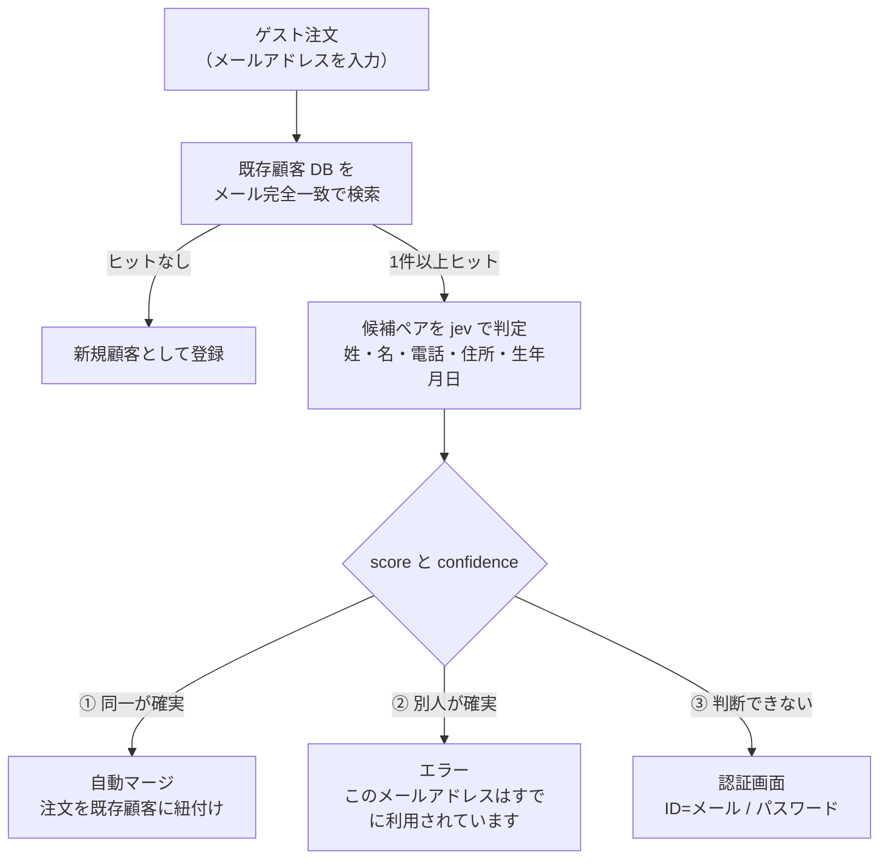
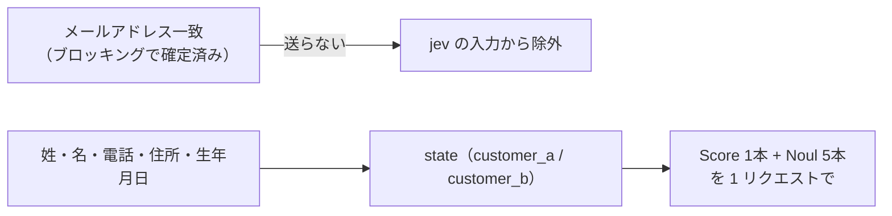
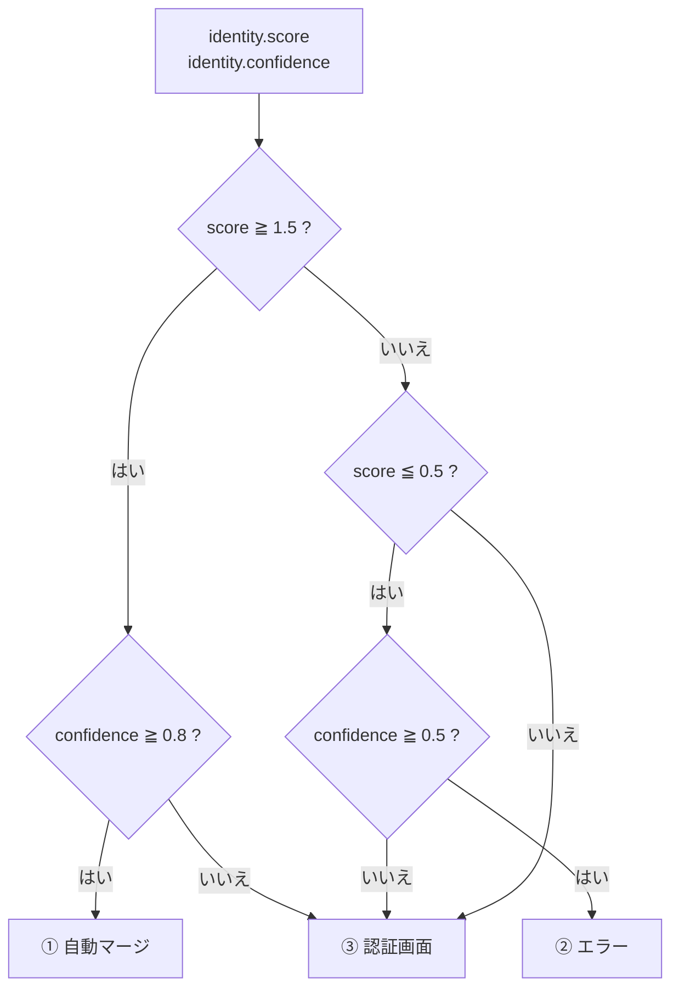

# ゲスト注文の名寄せ判定（EC サイト / jev）

EC サイトのゲスト注文で入力されたメールアドレスが既存顧客と一致したとき、
**同一人物か別人かを jev（TypeSafe）で判定**し、後続の処理を 3 分岐させる設計です。

- 作成日: 2026-09-23
- 使用モデル: `jev-latest`（実測時の実体は `jev-1.13.0`）
- 評価: 日本語 30 パターン（`npm run eval:name-matching`）
- 前提知識: [入力モデレーション（moderation.md）](./moderation.md) と同じ jev の使い方。名寄せ一般の整理は [§6 応用](./moderation.md#6-応用-顧客データの名寄せ判定entity-alignment) を参照

---

## 1. ユースケースと要件

### 1.1 前提

| 項目 | 内容 |
|------|------|
| 目的 | ゲスト注文の入力を既存顧客レコードに正しく紐付ける |
| 一次絞り込み | 既存 DB から**メールアドレスの完全一致**でレコードを抽出（プログラム） |
| 二次判断 | 抽出した候補ペアを **jev が判定**（姓・名・電話・住所・生年月日） |
| メールの扱い | **メールが一致している事実は jev に伝えない**（§2.2） |

### 1.2 3 つの結末

| 分岐 | 条件 | 処理 |
|------|------|------|
| ① 同一人物が確実 | score が高く確信度も高い | **自動マージ**（注文を既存顧客に紐付け） |
| ② 別人が確実 | score が低く確信度がある | **エラー**（「そのメールアドレスはすでに利用されています」） |
| ③ どちらとも言えない | 上記以外 | **認証画面**（ID=メール / パスワード） |

② が想定しているのは「**別人が何らかの経路で他人のメールアドレスを入手した**」ケースです。

### 1.3 全体の流れ



---

## 2. jev への問い合わせ設計

### 2.1 何を送り、何を送らないか



**メールを送らない理由**

1. **判断を引きずらせないため。** メール一致は今回の判定で「疑わしい対象」そのものです。これを state に入れると、モデルが「メールが一致しているのだから同一人物だろう」とアンカリングする可能性があります。
2. **PII を減らせる。** メールアドレスは識別性が高く、送らなくて済むなら送らない方が良い項目です。

結果として jev は「**個人属性だけを見て同一人物かどうかを判断**」します。実測でも、同姓同名の別人（D01）や全項目が異なるケース（D05）は score 0.06 / 0.00 で ② に落ちています。

### 2.2 state の形

```json
{
  "customer_a": {
    "surname": "佐藤",
    "given_name": "太郎",
    "phone": "090-1234-5678",
    "address": "東京都新宿区西新宿2-8-1",
    "birth_date": "1985-04-12"
  },
  "customer_b": {
    "surname": "佐藤",
    "given_name": "太郎",
    "phone": "09012345678",
    "address": "東京都新宿区西新宿二丁目8番1号",
    "birth_date": "1985年4月12日"
  }
}
```

- **値は正規化しないでそのまま渡します。** 表記ゆれの吸収は jev の役割であり、事前に正規化するとその能力を使えません（例：`2-8-1` と `二丁目8番1号`）。
- 姓と名は**分けて**渡します（「姓だけ一致」と「フルネーム一致」を区別させるため）。

### 2.3 質問（1 リクエストにまとめる）

| ID | 型 | 問い |
|----|----|------|
| `identity` | Score 3 レベル | 2 つのレコードは同一人物か |
| `same_surname` | Noul | 姓は同じか（カナ/漢字・旧姓を許容） |
| `same_given_name` | Noul | 名は同じか（カナ/漢字・表記ゆれを許容） |
| `same_phone` | Noul | 電話番号は同じか（ハイフン・全角を許容） |
| `same_address` | Noul | 住所は同じか（数字表記・都道府県省略を許容） |
| `same_birth_date` | Noul | 生年月日は同じか（日付形式を許容） |

`identity` の 3 レベル（**レベルがそのまま 3 つの結末に対応**）：

| レベル | 記述 | 結末 |
|--------|------|------|
| 0 | They are different people: the identifying details disagree in ways that a variant spelling, a move, or a name change cannot explain. | ② エラー |
| 1 | It is not clear whether they are the same person: some details agree and others disagree, a detail is missing, or the difference could come from a life change such as marriage or moving house. These records alone are not enough to decide. | ③ 認証画面 |
| 2 | They are the same person: the details agree once kana/kanji variants, address formatting, date formats, and name changes are taken into account. | ① 自動マージ |

- **レベル 1 の文言が最も重要**です。「改姓・転居・情報欠落」を明記することで、
  正当な同一人物を誤って「別人」に倒すのを防ぎ、代わりに人手（認証画面）へ回せます。
- 5 本の Noul は判定には使いませんが、**③ に落ちたときの説明材料**（どの項目が食い違っているか）と、
  運用ログ・人手レビューの判断材料になります。
- 電話・生年月日は本来「数値の比較」なのでコードでも判定できますが、
  **表記ゆれ（全角/半角・ハイフン・日付形式）の吸収を jev に任せる**ために state に含めて質問しています。

### 2.4 判定ルール（行動ごとに確信度を変える）

TypeSafe の [Confidence](https://docs.typesafe.ai/confidence) の考え方に従い、
**行動のリスクに応じて確信度の要求を変えます**。

| 行動 | 条件 | 理由 |
|------|------|------|
| ① 自動マージ | `score >= 1.5` **かつ** `confidence >= 0.8` | 誤マージは復旧が難しく、リスクが最も高い |
| ② エラー | `score <= 0.5` **かつ** `confidence >= 0.5` | 安全側の行動なので要求は緩めでよい |
| ③ 認証画面 | 上記以外 | 迷ったら人（認証）に委ねる |



### 2.5 実装のポイント

- **判定はフロー層の 1 箇所に置く。** ゲスト注文の登録経路が複数（Web / 管理画面 / バッチ）ある場合、経路ごとに実装すると抜け道ができます。
- **失敗時の挙動を決める。** TypeSafe が応答しない場合、① と ② は出せません。安全側に倒すなら **③ 認証画面**（＝ fail-closed に近い）が妥当です。生成アプリのときのような fail-open（そのまま通す）は、この用途では「別人を素通しする」ことを意味するため推奨しません。
- 応答の `model`（例 `jev-1.13.0`）を必ず保存してください。判断基準の変更履歴を追えます。

### 2.6 コストとレイテンシ

| 項目 | 実測値 |
|------|--------|
| 入力トークン | **777 / ペア**（顧客 2 件 + Score 1 + Noul 5） |
| 1 ペア | **約 $0.000033（≒ ¥0.005）** |
| 1 万ペア | 約 $0.33（¥50） |
| 100 万ペア | 約 $33（¥5,000） |
| jev の API 往復 | 約 0.2〜0.25 秒（ウォーム時）。詳細は [moderation.md §3.5](./moderation.md#35-レイテンシ実測) |

ゲスト注文 1 件につき候補ペアは通常 1〜数件なので、**ユーザー体感の追加は 0.5 秒程度**です。
膨大な既存データに対する一括名寄せに使う場合はレート制限（20 リクエスト/秒）が上限になります。

---

## 3. 30 パターンでの精度評価

### 3.1 テストデータ

| 区分 | 件数 | 期待する結末 | 例 |
|------|-----:|--------------|-----|
| 同一人物 | 11 | ① 自動マージ | 完全一致、電話のハイフン無し、住所の算用/漢数字、生年月日の形式ゆれ、カナ→漢字、全角数字、建物名の表記ゆれ、法人格表記、都道府県省略、旧字体（渡辺/渡邊） |
| 中間 | 9 | ③ 認証画面 | 婚姻による改姓、引っ越し＋電話変更、家族でメール共有、生年月日の登録ミス、住所の番地違い、名の 1 字違い、住所未登録、ひらがな登録＋電話変更、代理注文 |
| 別人 | 10 | ② エラー | 同姓同名、姓のみ一致、兄弟、生年月日のみ一致、無関係、電話のみ一致、似ているが別、シェアハウス、法人と個人、同姓同名の親子 |

> 初回の評価では「旧字体（渡辺/渡邊）」を中間に分類していましたが、姓の異体字違いだけで
> 住所・電話・生年月日がすべて一致しており同一人物と確定できるため、**ラベル側の誤り**として同一に移しました。

### 3.2 結果

実行: 2026-09-23 / `jev-1.13.0` / 30 件すべて判定成功

| # | ケース | 期待 | score | 確信度 | 実測 | Noul（姓/名/電話/住所/生年） |
|---|--------|------|------:|-------:|------|------------------------------|
| T01 | 完全一致 | 同一 | 2.00 | 0.99 | ① | .98/.98/.99/.98/.99 |
| T02 | 電話のハイフン無し | 同一 | 1.99 | 0.98 | ① | .98/.98/.98/.96/.99 |
| T03 | 住所 算用数字→漢数字 | 同一 | 1.99 | 0.99 | ① | .97/.97/.99/.97/.99 |
| T04 | 生年月日の形式ゆれ | 同一 | 2.00 | 0.99 | ① | .98/.97/.98/.95/.98 |
| T05 | 姓名のスペース差 | 同一 | 2.00 | 1.00 | ① | .98/.99/.99/.98/.99 |
| T06 | カナ登録→漢字登録 | 同一 | 2.00 | 0.99 | ① | .97/.93/.99/.96/.99 |
| T07 | 全角数字の電話 | 同一 | 1.98 | 0.97 | ① | .97/.97/.99/.95/.99 |
| T08 | 建物名・部屋番号の表記ゆれ | 同一 | 2.00 | 0.99 | ① | .98/.98/.99/.95/.99 |
| T09 | 法人名の表記ゆれ | 同一 | 1.98 | 0.97 | ① | .89/.97/.99/.96/.74 |
| T10 | 都道府県の省略 | 同一 | 1.98 | 0.96 | ① | .98/.98/.99/.96/.99 |
| T11 | 旧字体（渡辺 / 渡邊） | 同一 | 1.97 | 0.96 | ① | .94/.95/.99/.94/.99 |
| M01 | 婚姻による改姓 | 中間 | 1.09 | 0.64 | ③ | .02/.97/.99/.97/.99 |
| M02 | 引っ越し＋電話番号変更 | 中間 | 1.24 | 0.55 | ③ | .97/.97/.01/.01/.99 |
| M03 | 家族でメール共有 | 中間 | 0.01 | 0.98 | **②** | .98/.01/.99/.97/.01 |
| M05 | 生年月日の登録ミス（日のみ違い） | 中間 | 0.79 | 0.27 | ③ | .98/.96/.99/.97/.01 |
| M06 | 住所の番地違い（2-1-5 / 2-1-15） | 中間 | 1.48 | 0.26 | ③ | .98/.97/.99/.04/.99 |
| M07 | 名の 1 字違い（大輔 / 大介） | 中間 | 1.13 | 0.20 | ③ | .97/.65/.98/.96/.02 |
| M08 | 住所が未登録（情報不足） | 中間 | **1.60** | **0.40** | ③ | .98/.98/.99/.08/.99 |
| M09 | ひらがな登録＋電話変更 | 中間 | 1.32 | 0.00 | ③ | .97/.97/.01/.96/.99 |
| M10 | 代理注文（勤務先住所で発注） | 中間 | 1.47 | 0.28 | ③ | .97/.97/.01/.02/.99 |
| D01 | 同姓同名の別人 | 別人 | 0.06 | 0.91 | ② | .97/.95/.01/.01/.01 |
| D02 | 姓のみ一致 | 別人 | 0.01 | 0.99 | ② | .97/.01/.01/.01/.01 |
| D03 | 兄弟（姓・住所・電話が一致） | 別人 | 0.25 | 0.63 | ② | .97/.02/.99/.97/.01 |
| D04 | 生年月日のみ一致 | 別人 | 1.14 | 0.62 | ③ | .97/.96/.01/.01/.99 |
| D05 | 全項目が無関係 | 別人 | 0.00 | 1.00 | ② | .01/.01/.01/.01/.01 |
| D06 | 電話番号だけ引き継がれた別人 | 別人 | 0.12 | 0.82 | ② | .01/.02/.98/.01/.01 |
| D07 | 似ているが別（太郎/太朗） | 別人 | 0.21 | 0.68 | ② | .96/.64/.01/.01/.01 |
| D08 | シェアハウス（住所のみ一致） | 別人 | 0.02 | 0.97 | ② | .01/.01/.01/.97/.01 |
| D09 | 法人と、その社名を使った個人 | 別人 | 0.82 | 0.53 | ③ | .24/.11/.01/.02/.04 |
| D10 | 同姓同名の親子 | 別人 | 0.12 | 0.82 | ② | .97/.96/.99/.97/.01 |

### 3.3 判定ポリシーの比較

| ポリシー | 期待どおり | **危険な誤り**<br/>（除外すべきペアを自動マージ） | 正規客の締め出し<br/>（同一人物をエラー） | 安全側で③ |
|----------|-----------:|----------------:|--------------------:|-----------:|
| レベル丸めのみ（確信度を使わない） | 26/30 | **1**（M08 1.60 / conf 0.40） | 0 | 2 |
| 一律の確信度ゲート 0.8 | 25/30 | **0** | 0 | 4 |
| **行動別ゲート（推奨）** | **27/30** | **0** | **0** | 2 |

- **危険な誤り（＝自動マージすべきでないペアをマージ）は 0 件**です。
- 一律ゲートは「別人」判定まで③に倒してしまい、② の件数が減ります（＝列挙リスクは下がるが、意図した UX と違う）。
  **行動別ゲートは「マージだけ厳しく、エラーは緩く」**することで、危険な誤りを 0 にしつつ期待どおりの分岐を最大化します。
- M03（家族でメール共有）は ② になりました。これは**別人と確定できる**（名も生年月日も違う）ため、② は妥当な結果と解釈できます。
- D04（生年月日の一致のみ）と D09（法人と個人）は期待と異なり ③ ですが、**安全側**の動作です（認証を通ればよい）。

### 3.4 分布から見えたこと

| 区分 | score の範囲 | confidence の範囲 |
|------|-------------|-------------------|
| 同一 11 件 | **1.97 〜 2.00** | **0.96 〜 1.00** |
| 中間 9 件 | 0.01 〜 1.60 | **0.00 〜 0.98** |
| 別人 10 件 | 0.00 〜 1.14 | 0.53 〜 1.00 |

- **同一人物は score 1.97 以上に固まりました。** 表記ゆれを吸収したうえで、確信度も 0.96 以上です。
  レベル 2 の文言に「カナ/漢字・住所の書式・日付形式・改姓を考慮する」と書いている効果が出ています。
- **中間は score も confidence も散らばります。** これが「判断できない」状態の現れで、③ に落ちるべきケースです。
- **唯一グレー帯を外れたのが M08（住所未登録、score 1.60）** で、他の 4 項目が一致するため score が上がっています。
  確信度は 0.40 と低く、**確信度ゲートが無ければ誤マージしていた**ケースです（§2.4 の根拠）。
- 別人の score は 0.25 以下に集中（例外は D04 と D09）。**同一（1.97〜）との間に広い空白**があります。

---

## 4. 設計上の注意点と懸念

### 4.1 自動マージは「認証」ではない ★最重要

姓・名・生年月日・住所・電話は**秘密情報ではありません**。漏洩データ、SNS、年賀状、名刺、本人の過去投稿などから入手できます。
したがって「属性が一致したから本人」という根拠は、**知識ベース認証（KBA）**の強度しかありません。

**推奨**

- **① 自動マージの範囲をデータの紐付けに限定する。** 注文履歴の統合までに留め、
  **ログイン状態の付与やアカウント操作権限は与えない**。権限が必要なら必ず ③ の認証を通す。
- ① でも **メール宛の確認（ワンタイムリンク等）** を挟めれば、属性一致に依存せず「メールを読める人」を確認できます。
  これが最も素直で強い対策です（②の誤判定による締め出しも同時に解消できます）。
- ① の発生率を監視し、同一 IP・短時間での多発を検知する。

### 4.2 「そのメールアドレスはすでに利用されています」は列挙攻撃に使える

② の文言は「このメールは既に登録済み」を確定で教えるため、**メールアドレスの存在確認（enumeration）**に利用できます。
EC サイトでは既存顧客リストの生成につながり得ます。

- 対策: レート制限・CAPTCHA、② でも中立な文言にする、② からもログイン導線を出す、など。
- ご要望の仕様として認識したうえで、リスク許容の判断が必要です。

### 4.3 情報が欠落している場合の扱い

M08 のように**片側の項目が空**の場合、残りの項目が一致していると score が上がります（1.60）。
確信度（0.40）が低いのでゲートで救えますが、**コード側のガード**も併用する価値があります。

> 自動マージは「姓・名・電話・住所・生年月日が**両側に揃っている**ペア」に限定する

ただし B2B（T09）は生年月日を持たないため、**顧客タイプごとに必須項目セットを変える**必要があります。

### 4.4 1 つのメールに複数の既存顧客がヒットする場合

「候補ペアを判定」と単数形で書いていますが、実務では 1 メールに複数レコードが紐付くことがあります
（家族で共有、過去の誤登録、重複レコードなど）。次を決めておく必要があります。

- 全ペアを判定したうえで、**① が 1 件でもあれば ① を優先**するのか、② が 1 件でもあれば ② にするのか。
- ① が複数（重複レコード同士）の場合はどうするか（自動マージせず人手に回す、など）。

**推奨**: 「② が 1 件でもあれば ②」「① が複数なら ③」のように、**安全側に倒す優先順位**を先に決めておく。

### 4.5 ③ の UX（パスワードを持たないゲスト）

ゲスト注文の文脈では、③ に来る人が**パスワードを持っていない／忘れている**ことがよくあります。

- **パスワードリセット導線を必ず併設**してください。これが無いと、同一人物なのに先へ進めなくなります。
- 「メールは登録済みだがパスワードが分からない」人を救う経路は、結果的に §4.1 のメール確認とも一致します。

### 4.6 精度評価の限界

- **30 件は小規模**です。特に「**別人なのに似ているペア**」（誤マージが最も高コスト）を厚くして、
  自社データで再評価してください。
- **中間ケースは実行ごとに揺れます**（同一入力で confidence が 0.03 → 0.00、0.41 → 0.28 など）。
  閾値を境界ぴったりの値にせず、余裕を持たせてください。同一・別人の揺れは小さめです（score ±0.03 程度）。
- CJK は英語ほど精度が保証されていない旨が TypeSafe 側から明記されています（[Models](https://docs.typesafe.ai/models#language-support)）。
  今回の 30 件では問題ありませんでしたが、表現のバリエーションが増えたら再評価が必要です。

### 4.7 個人情報の取り扱い

氏名・住所・電話・生年月日を外部 API に送信します。
個人情報保護法 28 条（外国にある第三者への提供）、委託先の監督、DPA・ZDR 契約の確認が前提です
（[moderation.md §6.6](./moderation.md#66-個人情報の取り扱い) と同じ論点）。

- メールアドレスを送らない設計は、**送信項目の最小化**としてそのまま対策になります。
- 本番導入前に法務・セキュリティのレビューを通してください。

### 4.8 内部統制（誤マージの復旧）

- 誤マージは**復旧が難しい**（顧客データが混ざる）ため、判定結果（score / confidence / 各 Noul / モデルバージョン）を必ず保存してください。
- 自動マージの**取り消し手順**を用意しておくことを推奨します（マージ前の状態を保持、または監査ログから逆算できるようにする）。

---

## 5. 実装

### 5.1 評価スクリプト

```bash
npm run eval:name-matching
```

`scripts/eval-name-matching.mts` が 30 パターンを実際の API に投げ、
ケースごとの `score` / `confidence` / 項目別 Noul と、3 つのポリシーの指標を表示します。
質問定義・ルーティング・テストデータはすべてスクリプト内にあります。

### 5.2 本番に組み込むときのチェックリスト

- [ ] 判定を 1 箇所（共通のフロー層）に実装した
- [ ] メールアドレスを jev に送っていない
- [ ] 行動別の確信度ゲート（マージ 0.8 / エラー 0.5）を実装した
- [ ] TypeSafe 障害時の挙動を決めた（推奨: ③ 認証画面に倒す）
- [ ] 必須項目が欠落したペアを自動マージしない（顧客タイプ別の必須項目を定義）
- [ ] 1 メールに複数ヒットした場合の優先順位を決めた
- [ ] 判定ログ（score / confidence / Noul / model）を保存した
- [ ] 誤マージの取り消し手順を用意した
- [ ] ② の文言の列挙リスクを評価し、レート制限等を入れた
- [ ] ③ にパスワードリセット導線を用意した
- [ ] 自動マージの範囲を「データの紐付け」に限定した（権限は付与しない）
- [ ] 個人情報の取り扱いについて法務・セキュリティのレビューを通した

### 5.3 参考リンク

- [Knowledge graph entity alignment（本設計が参考にした cookbook）](https://docs.typesafe.ai/cookbooks/entity_alignment)
- [Confidence（行動別のしきい値の考え方）](https://docs.typesafe.ai/confidence)
- [Confidence-gated routing](https://docs.typesafe.ai/patterns/confidence-routing)
- [Score（レベルの書き方）](https://docs.typesafe.ai/primitives/score)
- [State（state の構造）](https://docs.typesafe.ai/concepts/state)
